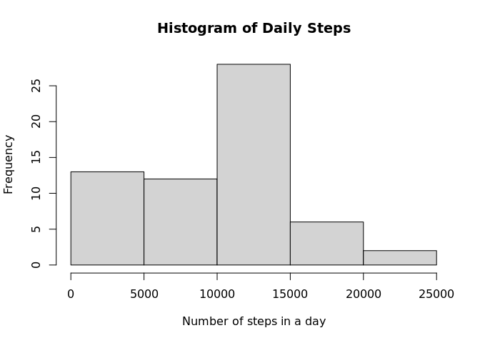
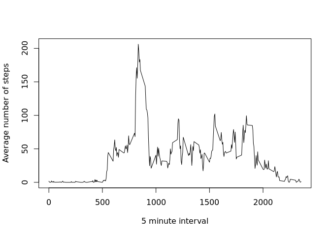
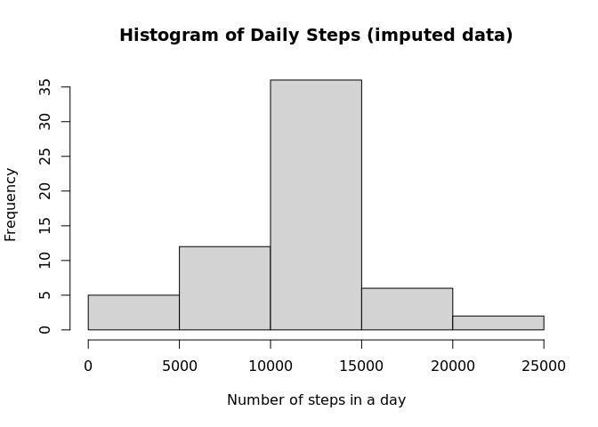
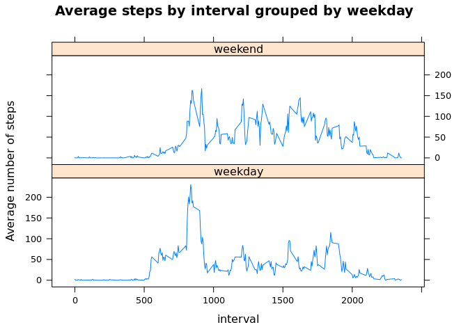

## Loading and preprocessing the data

First, extract the data to a /data/ directory

```r
if (!dir.exists("./data/")) {
  unzip("activity.zip", exdir = "./data/")
}
```
Next, load activity.csv into memory

```r
activity <- read.csv("./data/activity.csv", colClasses = c("integer", "Date", "integer"))
```
Finally, load libraries required for processing and manipulating the data

```r
if(!require(dplyr)) {
  install.packages("dplyr")
}
if(!require(lattice)) {
  install.packages("lattice")
}
```

## What is mean total number of steps taken per day?

Produce a tibble with a sum column summarizing the total number of daily steps

```r
daily_steps <- summarize(group_by(activity, date),total = sum(steps, na.rm = TRUE))
```
Plot a histogram with the number of steps on each given day

```r
hist(daily_steps$total, main = "Histogram of Daily Steps", 
     xlab = "Number of steps in a day")
```

<!-- -->

From here, we can calculate the mean and median number of daily steps

```r
mean(daily_steps$total)
```

```
## [1] 9354.23
```


```r
median(daily_steps$total)
```

```
## [1] 10395
```

## What is the average daily activity pattern?

From here, we can regroup the data by averaging the activity across all days at a given time interval

```r
by_interval <- summarize(group_by(activity, interval),average = mean(steps, na.rm = TRUE))
```
Then plot it

```r
plot(by_interval$interval, by_interval$average, type='l', xlab = "5 minute interval", ylab="Average number of steps")
```

<!-- -->

Now we can look at which interval contains the highest average number of steps


```r
by_interval[[which.max(by_interval$average),1]]
```

```
## [1] 835
```

And also what the value of that maximum is


```r
max(by_interval$average)
```

```
## [1] 206.1698
```

## Imputing missing values

First we should determine how many missing values there are in the table


```r
table(is.na(activity))
```

```
## 
## FALSE  TRUE 
## 50400  2304
```

In order to impute these values, we can assume that a given NA interval on any day is equal to the average daily value of that interval. To achieve this, we create a function that we can later use with an `apply()` loop to substitute a value for the average interval value we calculated earlier if it is NA, otherwise return the original value.


```r
subNA <- function(x) {
    if (is.na(x[1])) {
        x[1] <- by_interval[[which(by_interval$interval == 
                                       as.numeric(x[3])),2]]
    }
    x[1]
}
```

Then we create a numeric vector with the newly imputed values and bind it column-wise to the rest of our activity table


```r
steps_imputed <- as.numeric(apply(activity, 1, subNA))
activity2 <- cbind(steps_imputed, activity[,2:3])
```

We can recreate our histogram from earlier with the newly imputed data frame


```r
daily_steps_imputed <- summarize(group_by(activity2, date),total = sum(steps_imputed))
```

```r
hist(daily_steps_imputed$total, 
     main = "Histogram of Daily Steps (imputed data)", 
     xlab = "Number of steps in a day")
```

<!-- -->

We can also look at the mean and median number of our new data


```r
mean(daily_steps_imputed$total)
```

```
## [1] 10766.19
```


```r
median(daily_steps_imputed$total)
```

```
## [1] 10766.19
```

As we can see, the histogram has significantly fewer 0 step days, because average values were assumed for previously NA days. We can also see that the mean and median of the average daily steps has converged, as a day full of NA values is now considered to be equal to 288 total intervals of average value, or an average day.

## Are there differences in activity patterns between weekdays and weekends?

First we will create a new column in our imputed data frame with two factor levels, weekday and weekend


```r
activity2$weekday <- sapply(activity2$date, function(x) { weekdays(x) == "Sunday" | weekdays(x) == "Saturday"})
activity2$weekday <- factor(activity2$weekday, labels=c("weekday", "weekend"))
```

Then we should summarize the data, grouping by weekday and interval and calculating the average


```r
by_interval_imputed <- summarize(group_by(activity2, interval, weekday),average = mean(steps_imputed))
```

Now, we can construct a lattice plot to compare the average steps at each interval by weekday factor


```r
xyplot(average ~ interval|weekday, data=by_interval_imputed, type='l', layout = c(1, 2), ylab = "Average number of steps", main="Average steps by interval grouped by weekday")
```

<!-- -->
